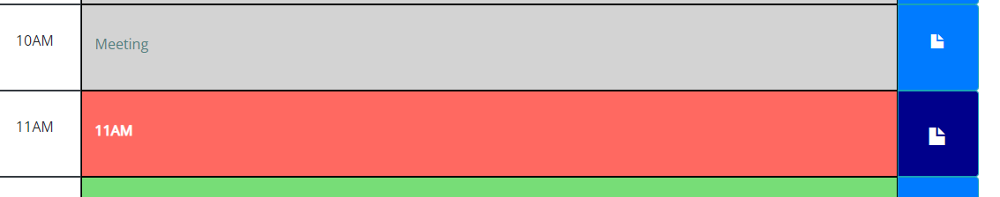

# Agenda Me!

## URL of application:

https://dsamuelson.github.io/AgendaMe/

## URL of Repository

https://github.com/dsamuelson/AgendaMe/

This is a simple agenda application to help schedule your day around your normal business hours

At the top you will notice the current date displayed and a clear button:

I decided it was best to go with a clear day button instead of automatically clearing the day on the end of the workday simply because there may be occasions in which you would like to keep some of yesterdays or an earlier days calendar items.

When you click on an event box the box will change to an edit field and you can enter in your desired text:

If you accidentally clicked the wrong box, you can simply click anywhere outside the box and the event will remain unchanged, when you would like to save the changes made you can simply push the save button:

depending on the current time the boxes will change color to show where you are during the day red is now, green is for future events, and grey is for past events:

the check event runs every minute and the date check runs every hour so you can have the most up-to-date view of what your day entails.